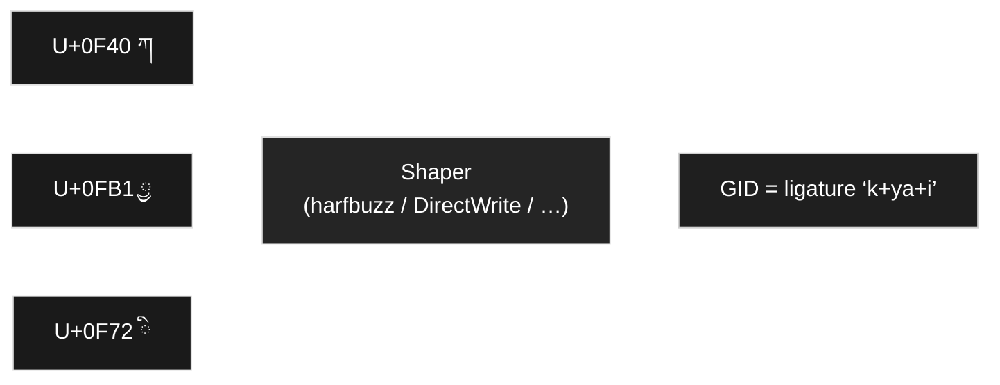
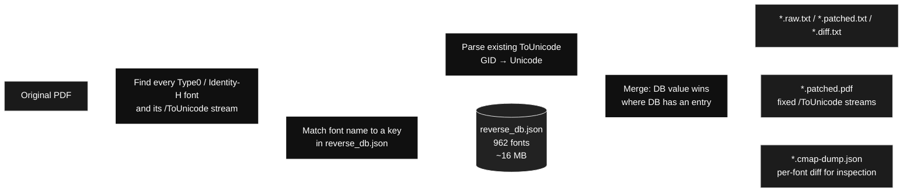
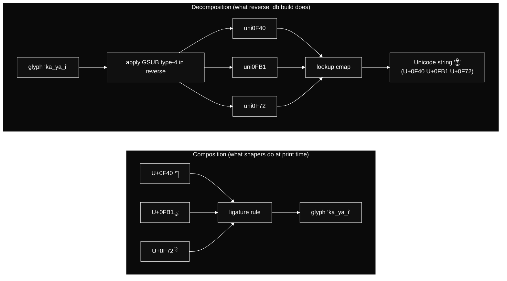
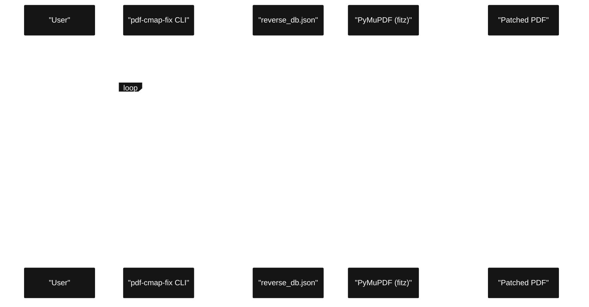

# Restoring Correct Tibetan Unicode from PDFs by Repairing Their `/ToUnicode` Maps

*How OpenPecha’s open-source tool [`pdf-cmap-fix`](https://github.com/OpenPecha/pdf-cmap-fix) rebuilds the glyph-to-Unicode tables inside a PDF from the actual source fonts, so extracted Tibetan matches what you see on the page.*

---

## Acknowledgements

**Development.** **`pdf-cmap-fix`** was developed by **Dharmaduta** from specifications provided by the **[Buddhist Digital Resource Center](https://www.bdrc.io)** (BDRC) for **“The BDRC Etext Corpus”**, with funding from the **Khyentse Foundation**.

**Authors** (software): **Ganga Gyatso** ([ganga@webuddhist.com](mailto:ganga@webuddhist.com)), **Elie Roux** ([roux.elie@gmail.com](mailto:roux.elie@gmail.com)).

---

## Hero illustration (optional)

Some reviewers welcome a **lead figure**: an editorial image suggesting **PDF + font → correct Unicode text** (for example a PDF icon merging with a glyph grid or OpenType motif, with an arrow toward a clean Tibetan text line). Flat vector style reads well on Medium and GitHub. **Accessibility:** add alt text such as *“Diagram: combining PDF content with font-derived glyph mappings to recover Unicode text.”* If the artwork is **AI-generated**, say so in the caption (tool name + human-directed prompt).

---

## What this article covers

`pdf-cmap-fix` exists to solve one specific, widespread problem: **Tibetan PDFs that render correctly on screen but produce wrong Unicode when their text is copied or extracted**. The cause is almost always the PDF's own `/ToUnicode` mapping table, written incorrectly by the document producer. The fix is to replace that table with a correct one, derived **directly from the source fonts** rather than from the producer's guess.

This article walks through:

- **Why this failure mode happens specifically with Tibetan** (and other complex scripts) and almost never with English.
- **What the tool actually changes** inside a PDF, and what it deliberately leaves alone.
- **How the bundled glyph database (`reverse_db.json`) is built** from real font files, with diagrams showing both the *composition* path used by font shapers and the *decomposition* path used by the database builder.
- **Measured results on two production-grade publications** committed to the repository as worked examples.
- **The boundaries of the approach** — the cases where it deliberately does nothing.
- **How to install and run it**, both as a command-line tool and as a Python library.

A working install and one PDF is all you need to follow along:

```bash
pip install git+https://github.com/OpenPecha/pdf-cmap-fix.git
pdf-cmap-fix your.pdf      # writes  your.raw.txt  your.patched.txt  your.diff.txt
pdf-cmap-fix -p your.pdf   # writes  your.patched.pdf
```

On a 528-page Microsoft Word export shipped in the repository (TI1055), one such run flips **10,205 lines** of extracted text from wrong to right and removes **23,725** spurious characters that the original PDF had silently inserted.

---

## A familiar problem: text that looks correct on screen but pastes wrong

Open a Tibetan PDF in Acrobat, press **Ctrl+A → Ctrl+C**, paste into Word.

What you typed in copies fine in English. Tibetan does not. From a real example in this repository, here is **one line** before and after the patch:

```
RAW:      བྗོད་གངས་ཅན་ལྗོངས་སུ་ནང་ཆྗོས་ཀྱི་དབུ་ཚུགས་པ་
PATCHED:  བོད་གངས་ཅན་ལྗོངས་སུ་ནང་ཆོས་ཀྱི་དབུ་ཚུགས་པ་
```

**Example provenance.** Tibetan publications distributed through **[Budaedu](https://www.budaedu.org/)** ([budaedu.org](https://www.budaedu.org/)) feed into BDRC-related digitisation workflows; the pattern above is representative of Word-export PDFs of that kind.

**Demo tip.** For screenshots or a short screencast, **extract a single page** (any PDF tool or reputable online “extract pages” service) so readers see one crisp **RAW vs PATCHED** pair without loading hundreds of pages. Full-corpus metrics below still refer to complete exports in the repository.

Notice the **spurious ྗ** (subjoined ja) sitting under several vowels in **RAW**. That extra letter is **invisible to a printer** because the visible glyph is the same; it is **catastrophic for search, NLP, and TEI alignment** because it changes the underlying Unicode.

This is not OCR error. The PDF really does say so to anyone reading its **`/ToUnicode`** stream. The pixels are right; the metadata is wrong.

---

## Why Tibetan script exposes weaknesses in PDF text extraction

Latin script is mostly a **1:1 mapping**: one Unicode code point per glyph (`A` ↔ glyph “A”). Tibetan is not. A common syllable like **`ཀྱི`** is **three** Unicode code points that the **font shaper** glues into **one ligature glyph**:



That **forward path** (Unicode → ligature glyph) is what makes the PDF **look** right. The **reverse path** (ligature glyph → original Unicode), used during **copy / extraction**, is the **`/ToUnicode`** CMap embedded in the PDF.

When the producer of the PDF guesses wrong, you get one of two failure modes:

| Producer | Typical lie | Effect |
|----------|-------------|---------|
| **InDesign** | drops subjoined letters (e.g. ligature gets mapped to `ཀི` instead of `ཀྱི`) | extracted text is **shorter and wrong** |
| **Word**     | inserts a spurious **ྗ** (or other) into vowel-only glyphs | extracted text is **longer and wrong** |

So the real question is not *“can we read Tibetan?”* but *“can we replace the producer’s wrong table with a correct one, derived from the actual font?”*

That is exactly what **`pdf-cmap-fix`** does.

---

## How `pdf-cmap-fix` processes a PDF, end to end



Three things are deliberately **not** in this diagram:

- **No re-OCR.** No pixels are read.
- **No re-rendering.** The visible page is untouched.
- **No overwrite of the original PDF.** Outputs land beside the input as separate files.

---

## How the bundled glyph database is built from the source fonts

**`reverse_db.json`** is a single JSON file shipped inside the package. It maps **font identity → { GID → Unicode string }**:

```json
{
  "monlamuniouchan2": {
    "216":  "ོ",
    "390":  "ལྔ",
    "1042": "རྐྱུ"
  },
  "himalaya":         { "...": "..." }
}
```

For the public build at the time of writing this article: **962 normalised font keys, ~16 MB on disk** ([full inventory](font-inventory.md)). The keys come from the actual filenames of fonts in the source archives (lower-cased letters and digits only), so a PDF font named `FPFIFO+Monlam#2320Uni#2320OuChan2` matches the key `monlamuniouchan2` after the same normalisation.

But how is the **right** Unicode for each glyph derived in the first place? That is the heart of the project.

### Two OpenType tables that already know the answer

Every TrueType / OpenType font knows two things that are almost always correct:

1. **`cmap`** — *“Unicode code point ↔ atomic glyph name.”*  
   `U+0F40` → glyph **`uni0F40`**. This is the alphabet, before any shaping.
2. **`GSUB` (Glyph Substitution), table type 4 — ligatures.**  
   *“These N component glyph names compose into this 1 ligature glyph.”*  
   `(uni0F40, uni0FB1, uni0F72)` → **`ka_ya_i`**.

GSUB type 4 is **how the shaper builds a stack**. We just need to **walk it backwards** to recover the Unicode behind each ligature.

### Composition versus decomposition, side by side



Concretely, the builder ([`scripts/build_reverse_db.py`](../scripts/build_reverse_db.py)) loads each font with [fontTools](https://fonttools.readthedocs.io/) and runs a small recursive walk:

```python
def decompose(gname):
    if gname in cmap_reverse:          # atomic letter or digit
        return cmap_reverse[gname]
    if gname in gsub_rules:            # ligature → component glyph names
        return "".join(decompose(c) for c in gsub_rules[gname])
    return ""                          # truly unmappable glyph
```

For every glyph ID `gid` in the font:

```text
gid → glyph name → decompose(...) → Unicode string
```

The result for one font is a **complete and authoritative GID → Unicode table** — derived **from the font itself**, not from anyone’s ToUnicode guess. Repeat for hundreds of Tibetan fonts; merge in a defined order (later sources override earlier on key collision); write JSON. That is `reverse_db.json`.

### Why deriving the database from the fonts is trustworthy

- It uses **the same OpenType data the rendering engine uses** (`cmap` + `GSUB`), so the Unicode it returns is what the original document author **typed**.
- It is **offline**: the database is built once from font archives (e.g. **bodyig**, public **tibetan-fonts**, a private Tibetan-fonts snapshot — see the [README](../README.md) for the exact precedence) and shipped with the package.
- It is **auditable**: every key in the JSON is a normalised font filename you can trace back to a `.ttf` / `.otf`.

### Refreshing one font without rebuilding the entire database

For maintainers who care about a **specific build** of a face (for example the **Microsoft Himalaya** that ships with their Windows install), the repo ships **[`scripts/update_reverse_db_from_windows_himalaya.py`](../scripts/update_reverse_db_from_windows_himalaya.py)**. It reads `%WINDIR%\Fonts\himalaya.ttf` and replaces only the `himalaya` entry inside `reverse_db.json` — no full rebuild needed.

---

## Inside the patching workflow: matching, merging, and writing the PDF

Once `reverse_db.json` exists, fixing a PDF reduces to three steps for every Type0 / Identity-H font we find:

1. **Match.** Strip the PDF subset prefix (e.g. `FPFIFO+`), decode hex escapes (`#23`, `#2320`), normalise to letters and digits. Look up that key in `reverse_db.json`.
2. **Merge.** Where the database has a value for a GID, **the database wins** — even if the PDF’s ToUnicode disagrees. (Empirically, the producer is wrong far more often than the font.)
3. **Write.** Replace the **`/ToUnicode`** stream of that font object with a fresh CMap built from the merged map. The font dictionary, the page content, and the visible glyphs are all left alone.



---

## Measured results on two production-grade Tibetan publications

Two PDFs are committed to the repository under [`docs/examples/`](examples/) along with their `.raw.txt`, `.patched.txt`, `.diff.txt`, and `.patched.pdf`:

| Example | Producer | Pages | Lines changed | Char delta |
|---------|----------|------:|--------------:|-----------:|
| **TI1751-01-001** | InDesign | 528 | **5,295** | **+10,093** |
| **TI1055-01-001** | MS Word  | 528 | **10,205** | **−23,725** |

Numbers are the headers of the committed `*.diff.txt` files.

### TI1751 — InDesign “drops subjoined letters”

Char delta is **positive**: the patched text **gains** characters because the PDF had been silently **deleting subjoined letters**. From line 4 of the committed diff:

```
RAW:      འོད་གསལ་ཀོང་ཡངས་རོལ་བའི་རྣལ་འབོར་པ་... ཀི་ཟབ་གཏེར།
PATCHED:  འོད་གསལ་ཀློང་ཡངས་རོལ་བའི་རྣལ་འབྱོར་པ་... ཀྱི་ཟབ་གཏེར།
```

The patch puts back the missing **subjoined la (ྵ)**, **subjoined ya (ྱ)** and friends.

### TI1055 — Word “injects spurious characters”

Char delta is **negative**: the patched text **loses** characters because the producer had been **adding noise** that the human never typed. From the committed diff:

```
RAW:      བྗོད་གངས་ཅན་... ཐྗོས་བསམ་སྗོམ་...
PATCHED:  བོད་གངས་ཅན་... ཐོས་བསམ་སྒོམ་...
```

A negative char delta is, in this case, the sign of **a successful clean-up**: extra glyphs that should never have been in the underlying Unicode are gone.

---

## Boundaries of the approach and known limitations

Honesty is part of the contract.

- **Type0 / Identity-H only.** Some Ghostscript and older TrueType-simple-encoded PDFs use byte codes that are **not** the font’s GIDs. This pipeline correctly refuses to touch them, because patching them blindly would produce garbled output. ([approach.md](approach.md) explains why.)
- **The font must be in `reverse_db.json`.** Unknown faces get `db_key_matched: null` and stay unchanged. Adding a font is a one-shot rebuild.
- **Viewer behaviour matters.** Some in-browser PDF tabs do a poor job of clipboard or font fallback for Tibetan even when the underlying ToUnicode is fine. **Adobe Acrobat Reader** (and most desktop viewers) handle the patched PDFs correctly. The package’s own `*.patched.txt` is the authoritative “what the patch produced.”

---

## Installing and running `pdf-cmap-fix`

```bash
pip install git+https://github.com/OpenPecha/pdf-cmap-fix.git

# Inspect: writes  doc.raw.txt  doc.patched.txt  doc.diff.txt
pdf-cmap-fix doc.pdf

# Emit a patched PDF
pdf-cmap-fix -p doc.pdf

# Dump per-font merged ToUnicode as JSON (does not modify the PDF)
pdf-cmap-fix --dump-cmap cmap.json doc.pdf
```

From Python:

```python
from pdf_cmap_fix import extract_pdf_text, patch_pdf, build_tounicode_dict

extract_pdf_text("doc.pdf")              # text + diff
patch_pdf("doc.pdf")                     # writes doc.patched.pdf
build_tounicode_dict("doc.pdf")          # per-font existing/merged/overrides
```

If you maintain your own font corpus, pass a custom `rev_db=` dict instead of using the bundled JSON — the merging logic is identical.

---

## How to cite


Ganga Gyatso & Elie Roux. (2026). *pdf-cmap-fix* . OpenPecha. https://github.com/OpenPecha/pdf-cmap-fix  


**Contact:** [ganga@webuddhist.com](mailto:ganga@webuddhist.com) · [roux.elie@gmail.com](mailto:roux.elie@gmail.com)

---

## Summary

Tibetan PDFs often fail in a way that is easy to miss: the page **looks** right because the font drew the correct ligatures, but the embedded **`/ToUnicode`** map tells extractors and the clipboard a different story—dropped stacks from InDesign, injected noise from Word, or other half-truths that poison search, alignment, and any pipeline that trusts “text inside the PDF.”

**[`pdf-cmap-fix`](https://github.com/OpenPecha/pdf-cmap-fix)** does not guess from pixels. It treats the **OpenType font** as the authority: the bundled **`reverse_db.json`** is built offline from hundreds of **`.ttf`** / **`.otf`** sources by walking **`cmap`** for atomic letters and **`GSUB` type-4** for ligatures, then walking those rules **backwards** so every glyph ID resolves to the Unicode string the shaper would have consumed in the forward direction. At patch time, the tool matches each embedded Type0 / Identity-H face to a key in that database, **merges** the database’s map into the PDF’s existing ToUnicode (the database wins where it has an entry), and **writes** new CMap streams—leaving the original bytes on disk alone unless you emit a separate **`*.patched.pdf`**.

The approach has clear edges: it targets **Identity-H** PDFs where character codes align with GIDs; it does nothing for fonts it cannot match; and some PDF viewers still handle Tibetan clipboard worse than a desktop reader even when the map is fixed. Within those bounds, the examples in this repository show the effect at publication scale—thousands of lines of extracted text corrected on real InDesign and Word exports.

**[OpenPecha](https://github.com/OpenPecha)** maintains this tool as part of open infrastructure for Tibetan textual heritage: a narrow bridge from “what the reader saw” to “what the Unicode string ought to have been,” so digitisation and research workflows can treat PDF text as data again. The source code, bundled database, worked examples, and installation instructions live in **[github.com/OpenPecha/pdf-cmap-fix](https://github.com/OpenPecha/pdf-cmap-fix)**. This article has been reviewed by **Ngawang Trinley** and **Evan Yerburgh** alongside the authors **Ganga Gyatso** and **Elie Roux**. For release numbering, CLI names, and rebuild commands, the root **[README](../README.md)** remains the canonical reference for the **0.2.x** line (`pdf-cmap-fix` / `pdf_cmap_fix`, successor to the earlier `tibetan-pdf-fix` package name).
