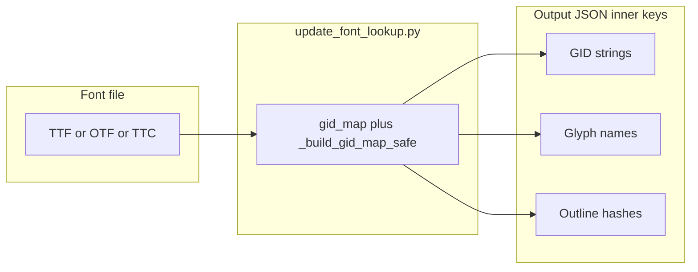

# Tier 2 and tier 3 font lookup JSON

Tier **1** (default) is the shipped **GID → Unicode** tree under `pdf_cmap_fix/data/font_lookup/`, built with `scripts/gid/update_font_lookup.py` or `scripts/gid/build_per_font_gid_maps.py`.  
Tier **2** uses `scripts/gname/update_font_lookup.py` / `scripts/gname/build_per_font_gname_maps.py`; tier **3** uses `scripts/gshape/…`. All use the **same** cmap + GSUB pipeline (`scripts/font_lookup_common/gid_map.py` via `_build_gid_map_safe`) so the **set of glyphs that receive a non-empty Unicode string** matches tier 1. Only the **JSON inner keys** change.

## Tier 2: glyph name → Unicode

- **Inner keys:** PostScript glyph names from `font.getGlyphOrder()[gid]` for each GID present in the tier-1 map.
- **Default output directory:** `pdf_cmap_fix/data/font_lookup_gname/` (override with `--lookup-dir`).
- **Use case:** PDFs whose embedded font still exposes **meaningful** names (`uni0F40`, Adobe names, etc.). Some producers emit only synthetic names (`glyph00001` …); then tier 2 does not help for matching by name alone.
- **Collisions:** If the same name were ever mapped twice with different strings (invalid font data), `_meta.glyph_name_collisions` lists the skipped rows; the first mapping wins.

## Tier 3: outline fingerprint → Unicode

- **Inner keys:** A stable string from `pdf_cmap_fix/glyph_fingerprint.py`: `HashPointPen` on the glyph outline, with `RoundingPointPen` + `floatToFixedToFloat` (14-bit) on composite transforms (see fontTools `hashPointPen` documentation).
- **Default output directory:** `pdf_cmap_fix/data/font_lookup_gshape/`.
- **Use case:** Offline indices for **shape-based** resolution when tier-1 GIDs from the PDF do not match your corpus `font_lookup` but outlines match a reference TTF you indexed.
- **Skipped glyphs:** If a glyph cannot be drawn for hashing, it is listed under `_meta.skipped_no_fingerprint` and omitted from the inner map (then `entries` can be slightly below `gids_mapped`).
- **Hash collisions:** Different glyph names with the same fingerprint but different Unicode strings are recorded in `_meta.hash_collisions`; the first mapping wins.

## `_meta` fields (all kinds)

| Field | Meaning |
|-------|---------|
| `lookup_kind` | `"gid"`, `"gname"`, or `"gshape"`. |
| `source` | Font path (and `::N` for TTC face index). |
| `gids_mapped` | Size of the tier-1 GID map used as the source of rows. |
| `multi_char_stacks` | Count of values whose string length is greater than one code point. |
| `gsub_lookup_counts` | GSUB lookup type histogram (tier 1 parity); may be `{}` after cmap-only retry. |
| `entries` | Inner map size (tiers 2 and 3 only; equals `gids_mapped` when nothing is skipped and there are no key collisions). |

Tier 3 also sets `fingerprint_method` (human-readable algorithm label).

## Relationship to `pdf-cmap-fix`

The tiered CLIs (`pdf-cmap-fix`, `pdf-cmap-fix-gname`, `pdf-cmap-fix-gshape`) each read only JSON whose ``_meta.lookup_kind`` matches that tier.

## Commands

### Single font

```bash
# Tier 2 (default directory: pdf_cmap_fix/data/font_lookup_gname/)
python scripts/gname/update_font_lookup.py path/to/font.ttf

# Tier 3 (default directory: pdf_cmap_fix/data/font_lookup_gshape/)
python scripts/gshape/update_font_lookup.py path/to/font.ttf

# Tier 1 (unchanged default)
python scripts/gid/update_font_lookup.py path/to/font.ttf
```

Same flags as tier 1: `--lookup-dir`, `--key`, `-o`, `--dry-run`, `--ttc-index`.

### Full corpus from ZIPs (same as tier 1)

From the repo root, with archives under `fonts/` (or `scripts/` as fallback; see main [README](../README.md) § Full rebuild):

```bash
python scripts/gname/build_per_font_gname_maps.py \
    --zip fonts/bodyig.zip \
    --zip fonts/tibetan-fonts-main.zip \
    --zip fonts/tibetan-fonts-private-main.zip
python scripts/gshape/build_per_font_gshape_maps.py \
    --zip fonts/bodyig.zip \
    --zip fonts/tibetan-fonts-main.zip \
    --zip fonts/tibetan-fonts-private-main.zip
```

Tier 1 bulk: **`scripts/gid/build_per_font_gid_maps.py`** (writes **`pdf_cmap_fix/data/font_lookup/`**). **`_manifest.json`** in each output directory includes **`lookup_kind`**.

## Workflow diagram (offline)


