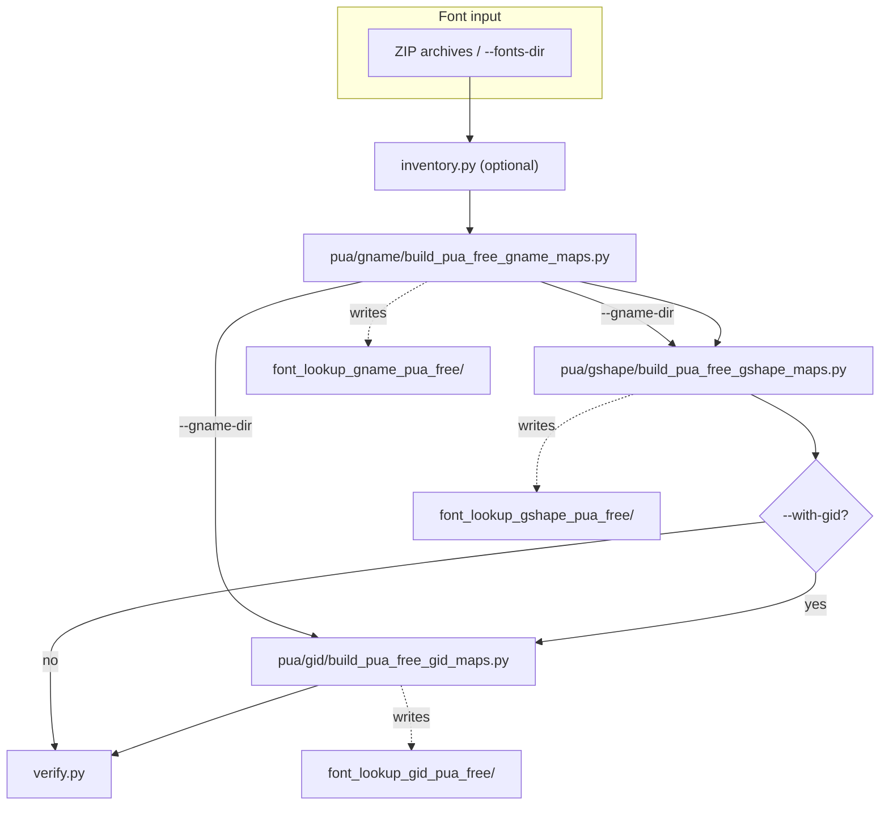
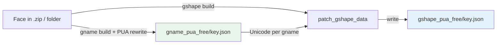
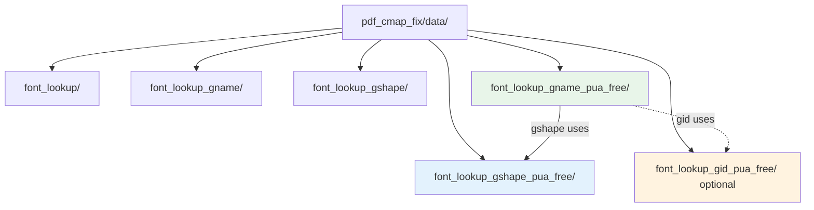

# PUA-free font lookups (global batch)

This workflow produces **sibling** lookup trees under `pdf_cmap_fix/data/` without modifying the bundled originals:

| Directory | Tier | What changes |
|-----------|------|----------------|
| `font_lookup_gname_pua_free/` | 2 | Glyph-name keys / string values: PUA from `uni…` names → public Unicode (via `pua_gname_rewriter.rewrite_gname_lookup_pua_values`). |
| `font_lookup_gshape_pua_free/` | 3 | Hash keys: resolve glyph name from font via `fingerprint_glyph`, join to **PUA-free gname** strings, patch rows that still contain PUA. |
| `font_lookup_gid_pua_free/` | 1 (optional) | GID → string via glyph order + gname map (`patch_gid_lookup_with_gname_inner`). |

**Font input**: ZIP archives, font directories, or single TTF files fed directly to each `scripts/pua/` CLI.

## Diagrams

### Orchestration (`run_all.py`)

Scripts run **in order**. Gname output is required before gshape and gid. Verification runs last (unless `--skip-verify`).



### Data flow for one font key

Tier 2 builds the gname map from the font and rewrites PUA values using `uni…` glyph name decoding. Tier 3 builds the gshape map from the same font, then patches PUA values using strings from `font_lookup_gname_pua_free` for the matching glyph name.



### Directory layout under `pdf_cmap_fix/data/`

Original lookup trees are **not** modified; `*_pua_free/` are **siblings**.



## One command

From the repository root (with **`fonts/*.zip`** in place):

```bash
python scripts/pua/run_all.py --with-gid
```

With explicit ZIPs:

```bash
python scripts/pua/run_all.py \
  --zip fonts/bodyig.zip --zip fonts/tibetan-fonts-main.zip --with-gid
```

Useful flags:

- `--with-gid` — also emit `font_lookup_gid_pua_free/`.
- `--skip-inventory` — skip the PUA inventory manifest step.
- `--skip-verify` — do not run `verify.py` at the end (verification often **fails** while still useful: many fonts keep PUA in values where tier-2 has no `uni…`-decodable glyph name, or gshape could not patch every row).

## Prerequisites

ZIP archives under **`fonts/`** (bodyig.zip, tibetan-fonts-main.zip, etc.). The `run_all.py` orchestrator discovers them automatically from `fonts/`; pass `--zip` to override.

## Step by step

```bash
# ── STEP 1: gname PUA-free (must run first) ──────────────────────────────────
python scripts/pua/gname/build_pua_free_gname_maps.py \
  --zip fonts/bodyig.zip --zip fonts/tibetan-fonts-main.zip

# ── STEP 2a: gshape PUA-free ──────────────────────────────────────────────────
python scripts/pua/gshape/build_pua_free_gshape_maps.py \
  --zip fonts/bodyig.zip \
  --gname-dir pdf_cmap_fix/data/font_lookup_gname_pua_free

# ── STEP 2b: gid PUA-free (optional) ──────────────────────────────────────────
python scripts/pua/gid/build_pua_free_gid_maps.py \
  --zip fonts/bodyig.zip \
  --gname-dir pdf_cmap_fix/data/font_lookup_gname_pua_free

# ── Inventory / verify ────────────────────────────────────────────────────────
python scripts/pua/inventory.py --out docs/build/pua_inventory.json
python scripts/pua/verify.py \
  pdf_cmap_fix/data/font_lookup_gname_pua_free \
  pdf_cmap_fix/data/font_lookup_gshape_pua_free
```

## Single-font updates

```bash
# gname: update one font
python scripts/pua/gname/update_pua_free_gname.py \
  --lookup-dir pdf_cmap_fix/data/font_lookup_gname_pua_free path/to/MyFont.ttf

# gshape: update one font (needs matching gname_pua_free JSON)
python scripts/pua/gshape/update_pua_free_gshape.py \
  --gname-json pdf_cmap_fix/data/font_lookup_gname_pua_free/myfont.json \
  path/to/MyFont.ttf

# gid: update one font
python scripts/pua/gid/update_pua_free_gid.py \
  --gname-json pdf_cmap_fix/data/font_lookup_gname_pua_free/myfont.json \
  path/to/MyFont.ttf
```

## Verification

`verify.py` exits **1** if any scanned JSON still has PUA in string values. That is **normal** for a full corpus: the goal is to **reduce** PUA (especially where `uni…` names and gshape joins apply), not to guarantee zero PUA everywhere.

## Runtime use

Point the extractor at the PUA-free trees, for example:

```bash
pdf-cmap-fix --font-lookup-dir pdf_cmap_fix/data/font_lookup_gshape_pua_free …
```

## Windows sample smoke test

For a **local gshape** walkthrough on Windows (Jomolhari + Cambria under system Fonts), see [local-jomolhari-gshape-pua-free.md](local-jomolhari-gshape-pua-free.md).

## Caveats

- **Hash collisions** (several glyph names → one fingerprint): logged in `_meta` where applicable; review inventory summaries.
- Full gshape rebuild is **CPU-heavy**; use per-font single-font scripts for incremental updates.
- **Corrupt or non-TrueType members** in zip archives are skipped (logged to stderr).
