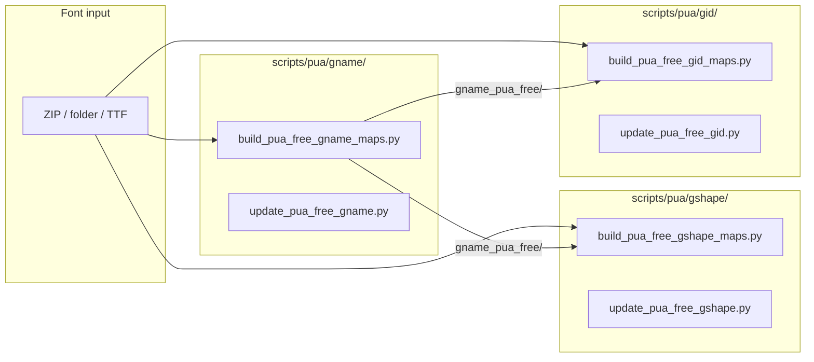

# scripts/pua — PUA-free font lookup builder

Replaces `scripts/lookup_pua/`. Builds PUA-free variants of all three lookup tiers by decoding `uni…` glyph names and fingerprint→gname cross-references.

## Dependency order



**gname must be built first.** gshape and gid both take `--gname-dir` pointing at the gname_pua_free output.

---

## Layout

```
scripts/pua/
  gname/
    build_pua_free_gname_maps.py   bulk: --zip / --fonts-dir → gname_pua_free/
    update_pua_free_gname.py       single TTF → one JSON in gname_pua_free/
    README.md
  gshape/
    build_pua_free_gshape_maps.py  bulk: --zip / --fonts-dir + --gname-dir
    update_pua_free_gshape.py      single TTF + --gname-json → one JSON
    README.md
  gid/
    build_pua_free_gid_maps.py     bulk: --zip / --fonts-dir + --gname-dir
    update_pua_free_gid.py         single TTF + --gname-json → one JSON
    README.md
  inventory.py                     scan lookup trees for PUA, write manifest
  verify.py                        exit 1 if any PUA remains in a directory
  run_all.py                       orchestrator: runs all tiers in order
```

Shared library modules live in **[`scripts/font_lookup_common/`](../font_lookup_common/README.md)**:
`pua_utils.py`, `pua_gname_rewriter.py`, `pua_gshape_patcher.py`, `pua_gid_patcher.py`, `font_archive_index.py`.

---

## Typical commands

```bash
# ── STEP 1: gname PUA-free (must run first) ──────────────────────────────────

# Bulk from ZIP archives
python scripts/pua/gname/build_pua_free_gname_maps.py \
  --zip fonts/bodyig.zip --zip fonts/tibetan-fonts-main.zip

# Custom output directory
python scripts/pua/gname/build_pua_free_gname_maps.py \
  --zip fonts/bodyig.zip -o ./builds/custom_gname_pua_free

# From a folder of loose .ttf / .otf
python scripts/pua/gname/build_pua_free_gname_maps.py \
  --fonts-dir /path/to/fonts -o ./builds/custom_gname_pua_free

# Single font
python scripts/pua/gname/update_pua_free_gname.py \
  --lookup-dir ./builds/custom_gname_pua_free path/to/MyFont.ttf

# ── STEP 2a: gshape PUA-free ──────────────────────────────────────────────────

python scripts/pua/gshape/build_pua_free_gshape_maps.py \
  --zip fonts/bodyig.zip \
  --gname-dir pdf_cmap_fix/data/font_lookup_gname_pua_free

# Custom dirs
python scripts/pua/gshape/build_pua_free_gshape_maps.py \
  --zip fonts/bodyig.zip \
  --gname-dir ./builds/custom_gname_pua_free \
  -o ./builds/custom_gshape_pua_free

# Single font (needs matching gname_pua_free JSON for this face)
python scripts/pua/gshape/update_pua_free_gshape.py \
  --lookup-dir ./builds/custom_gshape_pua_free \
  --gname-json ./builds/custom_gname_pua_free/jomolhari.json \
  path/to/Jomolhari-Regular.ttf

# ── STEP 2b: gid PUA-free ─────────────────────────────────────────────────────

python scripts/pua/gid/build_pua_free_gid_maps.py \
  --zip fonts/bodyig.zip \
  --gname-dir pdf_cmap_fix/data/font_lookup_gname_pua_free

# Single font
python scripts/pua/gid/update_pua_free_gid.py \
  --lookup-dir ./builds/custom_gid_pua_free \
  --gname-json ./builds/custom_gname_pua_free/microsofthimalaya.json \
  path/to/MicrosoftHimalaya.ttf

# ── Run everything at once ────────────────────────────────────────────────────
python scripts/pua/run_all.py --with-gid

# With explicit ZIPs
python scripts/pua/run_all.py --zip fonts/bodyig.zip --zip fonts/tibetan-fonts-main.zip --with-gid

# ── Inventory / verify ────────────────────────────────────────────────────────
python scripts/pua/inventory.py --out docs/build/font_lookup_pua_manifest.json
python scripts/pua/verify.py pdf_cmap_fix/data/font_lookup_gname_pua_free
python scripts/pua/verify.py \
  pdf_cmap_fix/data/font_lookup_gname_pua_free \
  pdf_cmap_fix/data/font_lookup_gshape_pua_free
```

---

## Inspect / diagnose

For interactive analysis of a single gname JSON (preview PUA map, test text replacement, write map JSON):

```bash
python scripts/misc/inspect_pua_gname.py pdf_cmap_fix/data/font_lookup_gname/jomolhari.json
python scripts/misc/inspect_pua_gname.py path/to/font.json --test-text "༧ང་"
```
